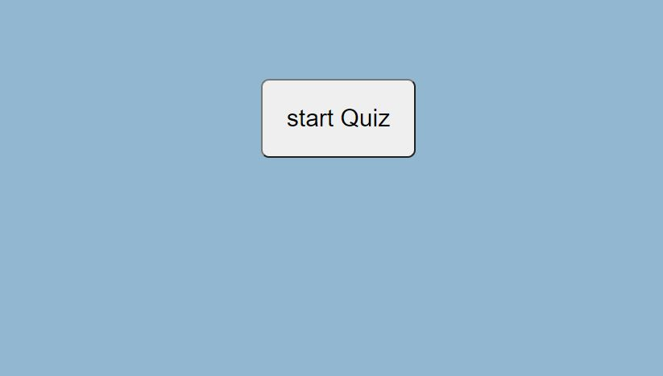

# codeQuiz

## Description 

In this assignment, we are asked to create a multiple choice quiz, one that will start when the user clicks the start button loaded on the screen. The quiz should be timed and to track and store the score.

---

## Installation

There should be no instillation involved. The link provided should take you straight to the webpage created on default web browser

[I am a link to the web page](https://cheetboy159.github.io/codeQuiz/)

## Usage 

If you follow the provided link in the installation section, it will take straight to the site. Aswering the prompts will result in generating the desired passowrd. 

## License

These files don't have a license and are there to fully share.

---
